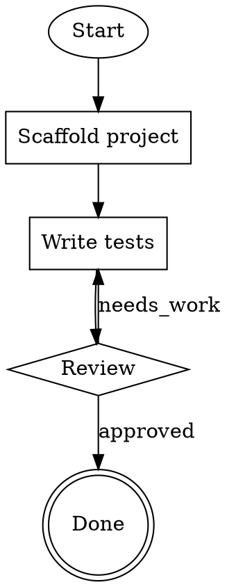

# Attractor

A DOT-defined pipeline runner for multi-stage AI coding workflows.

Implements three integrated layers:

1. **Unified LLM Client** — Multi-provider SDK supporting Anthropic, OpenAI, Gemini, and Ollama (local models)
2. **Coding Agent Loop** — Agentic tool-use loop with file editing, shell access, and search
3. **Pipeline Engine** — DAG-based workflow orchestration using Graphviz DOT syntax

Based on the [Attractor specification](https://github.com/strongdm/attractor).

## Prerequisites

- **Bun** 1.0 or later — [download](https://bun.sh/)
- **Ollama** (for local models) — [download](https://ollama.com/download)

Verify your installations:

```bash
bun --version     # should print 1.x or later
ollama --version  # should print 0.x.x or later
```

## Building Attractor

Clone and build the project first:

```bash
git clone https://github.com/strongdm/attractor.git
cd attractor
bun install
bun run build
```

This compiles TypeScript into `dist/` and makes Attractor available for local use.

---

## Getting Started with Ollama (Recommended for Local Use)

This section walks through every step from installing Ollama to running your first pipeline. No API keys or cloud accounts required.

### Step 1 — Install and Start Ollama

Download Ollama from [ollama.com/download](https://ollama.com/download) and install it. On Windows it runs as a background service automatically after installation.

Verify it's running:

```bash
curl http://localhost:11434/api/version
```

You should see a JSON response with version info. If not, start Ollama manually:

```bash
ollama serve
```

### Step 2 — Pull a Model

Pull the model you want to use. For coding tasks, `qwen3-coder:30b` is recommended if your machine has enough RAM (~20GB). For smaller machines, use a lighter model:

```bash
# Large / powerful (requires ~20GB RAM)
ollama pull qwen3-coder:30b

# Medium (requires ~10GB RAM)
ollama pull qwen3:8b

# Small / fast (requires ~5GB RAM)
ollama pull codellama:7b
```

Verify the model is available:

```bash
ollama list
```

### Step 3 — Create Your Project

Create a **separate directory** for your project (do NOT put your scripts inside the attractor source directory):

```bash
# Go to wherever you keep projects
cd c:\projects

# Create a new directory
mkdir my-ai-pipeline
cd my-ai-pipeline

# Initialize a project
bun init
```

### Step 4 — Link Attractor into Your Project

Since Attractor is built locally, use `bun link` to make it available to your project:

```bash
# Terminal 1: In the attractor directory, register it globally
cd c:\github\crowne\attractor
bun link

# Terminal 2: In your project directory, link to it
cd c:\projects\my-ai-pipeline
bun link attractor
```

Bun runs TypeScript natively, so no extra dev dependencies are needed.

Edit `package.json` to add the module type and register attractor as a link dependency (required for bun to resolve the linked package):

```json
{
  "name": "my-ai-pipeline",
  "type": "module",
  "scripts": {
    "start": "bun run src/main.ts"
  },
  "dependencies": {
    "attractor": "link:attractor"
  }
}
```

> **Note:** The `"attractor": "link:attractor"` entry in `dependencies` is required for bun to resolve the linked package. Without it, imports from `"attractor"` will fail even after running `bun link attractor`.

Create a `tsconfig.json`:

```json
{
  "compilerOptions": {
    "target": "ES2022",
    "module": "ESNext",
    "moduleResolution": "bundler",
    "esModuleInterop": true,
    "strict": true,
    "outDir": "dist"
  },
  "include": ["src"]
}
```

Your project structure should look like this:

```
c:\projects\my-ai-pipeline\
├── node_modules/
│   └── attractor -> c:\github\crowne\attractor   (symlink from bun link)
├── src/
│   └── main.ts        (you create this — see examples below)
├── package.json
└── tsconfig.json
```

### Step 5 — Write Your Script

Create `src/main.ts` with one of the examples below, then run it:

```bash
bun run src/main.ts
```

---

## Examples

### Example 1 — Simple Agent Chat (Ollama)

The simplest way to use Attractor: ask a local model to do a coding task.

**File: `src/main.ts`**

```typescript
import { Attractor } from "attractor";

async function main() {
  const attractor = await Attractor.create({
    dotSource: "digraph { start [shape=ellipse] }",
    provider: "ollama",
    model: "qwen3-coder:30b",   // must match a model you pulled in Step 2
  });

  const response = await attractor.runAgent(
    "Create a file called hello.ts that exports a function greeting(name: string) returning a greeting string"
  );

  console.log("Agent response:", response);
}

main().catch(console.error);
```

**Run it:**

```bash
bun run src/main.ts
```

The agent will use the local Ollama model to generate code and write it to disk in your current working directory.

### Example 2 — Pipeline with Ollama

A multi-step pipeline that implements a feature, then reviews it.

**File: `src/main.ts`**

```typescript
import { Attractor } from "attractor";

async function main() {
  const attractor = await Attractor.create({
    dotSource: `
      digraph pipeline {
        start      [shape=ellipse,       label="Start"]
        implement  [shape=box,           label="Implement feature",
                    prompt="Create a TypeScript file calculator.ts with add, subtract, multiply, divide functions. Include input validation and error handling for division by zero."]
        review     [shape=diamond,       label="Review"]
        done       [shape=doublecircle,  label="Done"]

        start -> implement -> review
        review -> implement [label="needs_work"]
        review -> done      [label="approved"]
      }
    `,
    provider: "ollama",
    model: "qwen3-coder:30b",
  });

  const result = await attractor.run();

  console.log("Pipeline finished:", result.state);
  console.log("Nodes executed:", result.results.length);

  for (const r of result.results) {
    console.log(`  [${r.node}] ${r.status}`);
  }
}

main().catch(console.error);
```

**Run it:**

```bash
bun run src/main.ts
```

### Example 3 — Using the LLM Client Directly (Ollama)

For lower-level access — send messages, get completions, no agent tools involved.

**File: `src/main.ts`**

```typescript
import { Client, userMessage } from "attractor";

async function main() {
  // Option A: Auto-detect Ollama (it checks localhost:11434 automatically)
  const client = Client.fromEnv();

  // Option B: Explicit configuration (uncomment to use)
  // import { OllamaAdapter } from "attractor";
  // const client = new Client({
  //   providers: {
  //     ollama: new OllamaAdapter({
  //       base_url: "http://localhost:11434",
  //       default_model: "qwen3-coder:30b",
  //     }),
  //   },
  // });

  const response = await client.complete({
    model: "qwen3-coder:30b",
    provider: "ollama",
    messages: [
      userMessage("Explain the difference between 'let' and 'const' in TypeScript. Be concise."),
    ],
  });

  console.log("Model:", response.model);
  console.log("Response:", response.message.content);
}

main().catch(console.error);
```

**Run it:**

```bash
bun run src/main.ts
```

### Example 4 — Pipeline from a .dot File

You can keep your pipeline definition in a separate `.dot` file for easier editing.

**File: `pipeline.dot`**



**File: `src/main.ts`**

```typescript
import { Attractor } from "attractor";
import { readFileSync } from "node:fs";

async function main() {
  const dotSource = readFileSync("pipeline.dot", "utf-8");

  const attractor = await Attractor.create({
    dotSource,
    provider: "ollama",
    model: "qwen3-coder:30b",
  });

  const result = await attractor.run();
  console.log("Pipeline finished:", result.state);
}

main().catch(console.error);
```

**Run it:**

```bash
bun run src/main.ts
```

### Example 5 — Using a Cloud Provider (Anthropic)

If you prefer a cloud model, set your API key and change the provider:

```bash
set ANTHROPIC_API_KEY=sk-ant-...your-key-here...
```

**File: `src/main.ts`**

```typescript
import { Attractor } from "attractor";

async function main() {
  const attractor = await Attractor.create({
    dotSource: `
      digraph pipeline {
        start      [shape=ellipse,       label="Start"]
        implement  [shape=box,           label="Implement feature",
                    prompt="Add a hello world endpoint"]
        review     [shape=diamond,       label="Review"]
        done       [shape=doublecircle,  label="Done"]

        start -> implement -> review
        review -> implement [label="needs_work"]
        review -> done      [label="approved"]
      }
    `,
    provider: "anthropic",
    model: "claude-opus-4-20250514",
  });

  const result = await attractor.run();
  console.log(result.state, result.results.length, "nodes executed");
}

main().catch(console.error);
```

---

## Environment Variables

Set these in your terminal before running, or in a `.env` file.

### Cloud Providers (need API keys)

| Variable | Provider | Description |
|----------|----------|-------------|
| `ANTHROPIC_API_KEY` | Anthropic | API key for Claude models |
| `OPENAI_API_KEY` | OpenAI | API key for GPT models |
| `GEMINI_API_KEY` or `GOOGLE_API_KEY` | Google | API key for Gemini models |

### Ollama (local models — no API key needed)

| Variable | Default | Description |
|----------|---------|-------------|
| `OLLAMA_HOST` or `OLLAMA_BASE_URL` | `http://localhost:11434` | URL of your Ollama server |
| `OLLAMA_API_KEY` | *(none)* | Only needed for remote/proxied Ollama instances behind auth |
| `OLLAMA_MODEL` | *(none)* | Default model name (e.g. `qwen3-coder:30b`) so you don't have to specify it every time |

**Setting environment variables on Windows:**

```bash
# Command Prompt
set OLLAMA_MODEL=qwen3-coder:30b

# PowerShell
$env:OLLAMA_MODEL = "qwen3-coder:30b"
```

Ollama is registered automatically when `OLLAMA_HOST`/`OLLAMA_BASE_URL` is set, or as a local fallback when no cloud provider keys are configured.

---

## Recommended Ollama Models for Coding

| Model | Pull Command | RAM Needed | Best For |
|-------|-------------|-----------|----------|
| `qwen3-coder:30b` | `ollama pull qwen3-coder:30b` | ~20 GB | Best local coding model, strong tool use |
| `qwen3:32b` | `ollama pull qwen3:32b` | ~20 GB | General purpose + coding |
| `deepseek-coder-v2:16b` | `ollama pull deepseek-coder-v2:16b` | ~10 GB | Good coding, moderate resources |
| `llama3.3:70b` | `ollama pull llama3.3:70b` | ~40 GB | Strongest open model (needs beefy machine) |
| `codellama:7b` | `ollama pull codellama:7b` | ~5 GB | Fast, lightweight, basic coding |

---

## Architecture

```
┌─────────────────────────────────────────────┐
│            Pipeline Engine (L3)             │
│  DOT parser → Graph → Validator → Engine    │
│  Node handlers, stylesheet, conditions      │
├─────────────────────────────────────────────┤
│           Coding Agent Loop (L2)            │
│  Session → LLM call → Tool exec → Loop     │
│  Provider profiles, steering, loop detect   │
├─────────────────────────────────────────────┤
│          Unified LLM Client (L1)            │
│  Anthropic · OpenAI · Gemini · Ollama        │
│  Streaming, retries, middleware, catalog    │
└─────────────────────────────────────────────┘
```

## Pipeline DOT Syntax

Nodes are typed by shape:

| Shape | Meaning | Handler |
|-------|---------|---------|
| `ellipse` | Start node | Pass-through |
| `box` | LLM/codergen task | Runs agent session |
| `diamond` | Conditional branch | Evaluates outcome |
| `hexagon` | Wait for human | Prompts user |
| `component` | Parallel fan-out | Runs branches concurrently |
| `tripleoctagon` | Fan-in / join | Waits for all branches |
| `doublecircle` | Exit / terminal | Ends pipeline |
| `plain` | Tool invocation | Runs specific tool |

### Edge Selection (5-step priority)

1. Explicit condition match (`condition` attribute)
2. Label matches `preferred_label`
3. Label matches `outcome`
4. Priority ordering (`priority` attribute)
5. Default/unlabeled edge

### Model Stylesheet

```css
* { model: "claude-sonnet-4-20250514"; temperature: 0; }
.fast { model: "claude-haiku-4-20250514"; }
#review { model: "claude-opus-4-20250514"; reasoning_effort: "high"; }
```

## Project Structure

```
src/
├── llm/                  # Layer 1: Unified LLM Client
│   ├── types.ts          # Data model (Message, Request, Response, etc.)
│   ├── catalog.ts        # Model catalog
│   ├── adapter.ts        # Provider adapter interface
│   ├── providers/        # Provider implementations
│   │   ├── anthropic.ts  # Anthropic Messages API
│   │   ├── openai.ts     # OpenAI Responses API
│   │   ├── gemini.ts     # Google Gemini API
│   │   └── ollama.ts     # Ollama (local models, Chat Completions API)
│   ├── client.ts         # Client with routing & middleware
│   └── generate.ts       # High-level API (generate, stream, generate_object)
├── agent/                # Layer 2: Coding Agent Loop
│   ├── types.ts          # Session, Turn, Event types
│   ├── session.ts        # Core agentic loop
│   ├── execution-env.ts  # Execution environment abstraction
│   ├── tools.ts          # Core tools (read/write/edit/shell/grep/glob)
│   ├── profiles.ts       # Provider-specific profiles
│   ├── loop-detection.ts # Loop detection via Jaccard similarity
│   └── truncation.ts     # Output truncation
├── pipeline/             # Layer 3: Pipeline Engine
│   ├── dot-parser.ts     # DOT language parser
│   ├── types.ts          # Graph model types
│   ├── graph-builder.ts  # DOT AST → PipelineGraph
│   ├── validator.ts      # Graph validation & linting
│   ├── engine.ts         # Execution engine
│   ├── handlers.ts       # Node handlers (codergen, conditional, etc.)
│   ├── conditions.ts     # Condition expression evaluator
│   ├── stylesheet.ts     # CSS-like model stylesheet
│   └── human.ts          # Human-in-the-loop system
└── index.ts              # Entry point & public API
```

## Troubleshooting

### Ollama connection refused

```
Error: connect ECONNREFUSED 127.0.0.1:11434
```

Ollama isn't running. Start it:

```bash
ollama serve
```

### Model not found

```
Error: model "qwen3-coder:30b" not found
```

You need to pull the model first:

```bash
ollama pull qwen3-coder:30b
```

### Out of memory

If Ollama crashes or responds very slowly, your model is too large for your available RAM. Try a smaller model:

```bash
ollama pull qwen3:8b
```

### bun link not resolving

If `import { Attractor } from "attractor"` fails after linking:

1. Make sure your project's `package.json` includes attractor as a link dependency:

```json
{
  "dependencies": {
    "attractor": "link:attractor"
  }
}
```

2. Re-link and install:

```bash
# Re-link (in attractor directory first, then your project)
cd c:\github\crowne\attractor
bun link
cd c:\projects\my-ai-pipeline
bun link attractor
bun install

# Verify the link exists
ls node_modules/attractor
```

### TypeScript errors when running

Make sure you're using `bun` to run TypeScript directly:

```bash
bun run src/main.ts
```

Bun runs TypeScript natively — no extra tooling required.

## License

Apache-2.0